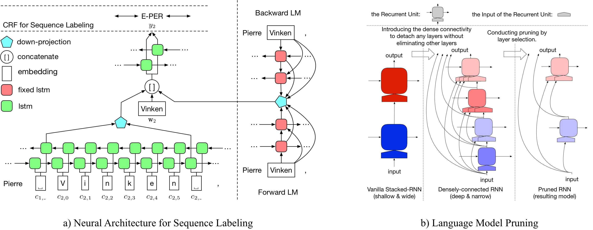

# LD-Net

[](http://ld-net.readthedocs.io/en/latest/?badge=latest)
[](https://opensource.org/licenses/Apache-2.0)

LD-Net provides sequence labeling models featuring:
- **Efficiency**: constructing *efficient contextualized representations* without retraining language models. 
- **Portability**: *well-organized*, *easy-to-modify* and *[well-documented](http://lm-lstm-crf.readthedocs.io/en/latest/)*.

Remarkablely, our pre-trained NER model achieved:
- **92.08** test F1 on the CoNLL03 NER task.
- **160K words/sec** decoding speed (**6X** speedup compared to its original model).

Details about LD-Net can be accessed at: https://arxiv.org/abs/1804.07827.

- [Model notes](#model-notes)
- [Benchmarks](#benchmarks)
- [Pretrained model](#pretrained-model)
	- [Language models](#language-models)
	- [Named Entity Recognition](#named-entity-recognition)
	- [Chunking](#chunking)
- [Training](#model-training)
	- [Dependency](#dependency)
	- [Data](#data)
	- [Model](#model)
	- [Command](#command)

## Model Notes



## Benchmarks

| Model for CoNLL03 | #FLOPs| Mean(F1) | Std(F1) |
| ------------- |-------------| -----| -----|
| Vanilla NER w.o. LM | | 3 M | 90.78 | 0.24 |
| LD-Net | 51 M | 91.86 | 0.15 |
| LD-Net (origin, picked based on dev f1) | 51 M | 91.95 |  |
| LD-Net (pruned) | **5 M** | 91.84 | 0.14 |

| Model for CoNLL00 | #FLOPs| Mean(F1) | Std(F1) |
| ------------- |-------------| -----| -----|
| Vanilla NP w.o. LM | | 3 M | 94.42 | 0.08 |
| LD-Net | 51 M | 96.01 | 0.07 |
| LD-Net (origin, picked based on dev f1) | 51 M | 96.13 |  |
| LD-Net (pruned) | **10 M** | 95.66 | 0.04 |


## Pretrained Models

Here we provide both pre-trained language models and pre-trained sequence labeling models.

### Language Models

Our pretrained language model contains word embedding, 10-layer densely-connected LSTM and adative softmax, and achieve an average PPL of 50.06 on the one billion benchmark dataset.

| Forward Language Model | Backward Language Model |
| ------------- |------------- |
| [Download Link](http://dmserv4.cs.illinois.edu/ld0.th) | [Download Link](http://dmserv4.cs.illinois.edu/ld_0.th)|

### Named Entity Recognition

The original pre-trained named entity tagger achieves 91.95 F1, the pruned tagged achieved 92.08 F1.

| Original Tagger | Pruned Tagger |
| ------------- |------------- |
| [Download Link](http://dmserv4.cs.illinois.edu/ner.th) | Preparing... |

### Chunking

The original pre-trained named entity tagger achieves 96.13 F1, the pruned tagged achieved 95.79 F1.

| Original Tagger | Pruned Tagger |
| ------------- |------------- |
| [Download Link](http://dmserv4.cs.illinois.edu/np.th) | Preparing... |


## Training

### Demo Scripts

To pruning the original LD-Net for the CoNLL03 NER, please run:
```
bash ldnet_ner_prune.sh
```

To pruning the original LD-Net for the CoNLL00 Chunking, please run:
```
bash ldnet_np_prune.sh
```

### Dependency

Our package is based on Python 3.6 and the following packages:
```
numpy
tqdm
torch-scope
torch==0.4.1
```

### Data

Pre-process scripts are available in ```pre_seq``` and ```pre_word_ada```, while pre-processed data has been stored in:

| NER | Chunking |
| ------------- |------------- |
| [Download Link](http://dmserv4.cs.illinois.edu/ner_dataset.pk) | [Download Link](http://dmserv4.cs.illinois.edu/np_dataset.pk) |


### Model

Our implementations are available in ```model_seq``` and ```model_word_ada```, and the documentations are hosted in [ReadTheDoc](http://lm-lstm-crf.readthedocs.io/en/latest/)

| NER | Chunking |
| ------------- |------------- |
| [Download Link](http://dmserv4.cs.illinois.edu/ner_dataset.pk) | [Download Link](http://dmserv4.cs.illinois.edu/np_dataset.pk) |
